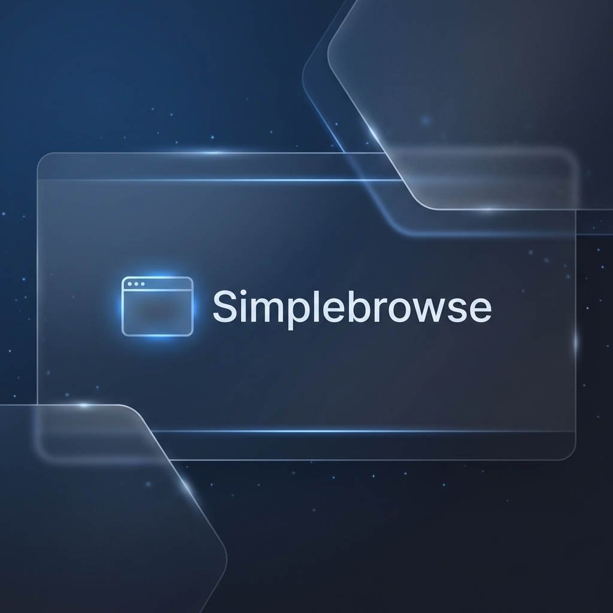

# 🌐 Simplebrowse



**Simplebrowse** is a premium, lightweight mini browser written in **C**. It leverages the power of **GTK+ 3** for its sleek, glassmorphism-inspired UI and **libcurl** for high-performance network requests. Designed for developers and minimalist enthusiasts, it provides a clean environment to inspect web content.

## ✨ Key Features

- **Sleek UI**: Modern GTK+ 3 interface with custom CSS for a premium dark-mode experience.
- **Fast Content Retrieval**: Powered by `libcurl` for reliable and quick URL fetching.
- **Real-time Source Inspection**: View the raw HTML/text content of any webpage instantly.
- **Lightweight Footprint**: Minimal resource usage, perfect for embedded systems or quick debugging.

## 🚀 Installation via VCPKG

This package is part of the [HSLCRB Registry Hub](https://github.com/hslcrb/vcpkg_hslcrb-s_pkgs).

1. Add the registry to your `vcpkg-configuration.json`:
```json
{
  "registries": [
    {
      "kind": "git",
      "repository": "https://github.com/hslcrb/vcpkg_hslcrb-s_pkgs",
      "packages": [ "simplebrowse" ]
    }
  ]
}
```

2. Install:
```bash
vcpkg install simplebrowse
```

## 🛠 Usage

After installation, the `simplebrowse` executable will be available in your path. Simply run:
```bash
simplebrowse
```
Enter a URL in the address bar and click **Go** to fetch content.

---
**Author:** Rheehose (Rhee Creative)
**Copyright:** © 2008-2026
**License:** MIT
**Technology Stack:** C11, GTK+ 3, libcurl
